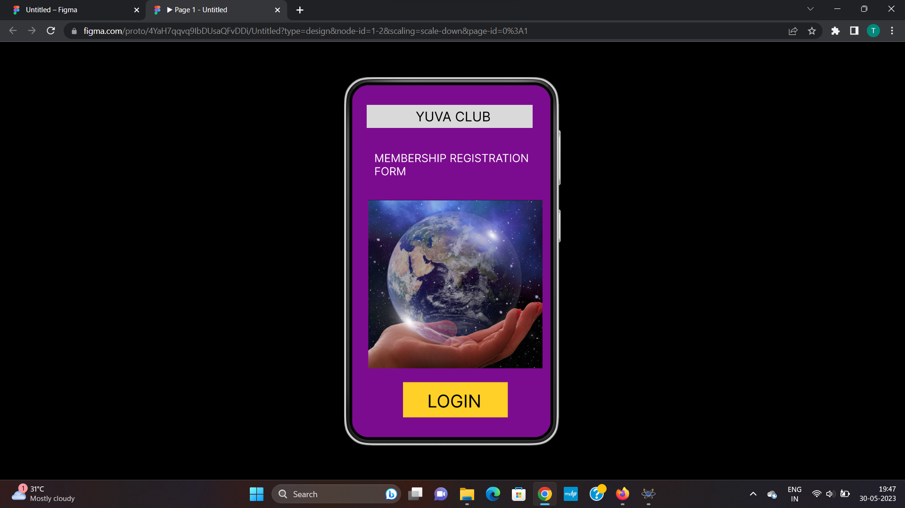
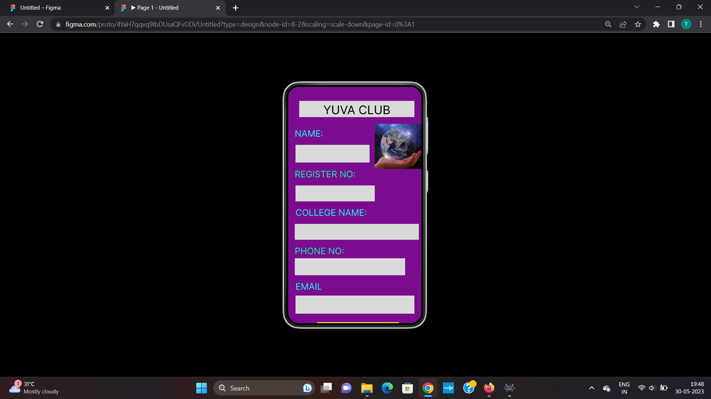
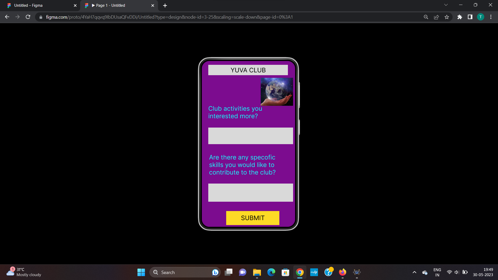

# Event Registration Web Application

## AIM:
To design, develop and deploy a web application for event registration.

## DESIGN STEPS:

### Step 1:
Create a new frame.

### Step 2:
Select any one preset size of your choice.

### Step 3:
Select the shapes you need.

### Step 4:
Import images as needed.

### Step 5:
Create pages based on your need and link them.

### Step 6:

Validate the HTML and CSS code.

### Step 6:

Publish the website in the given URL.

## DESIGN TOOL:
Figma

## CODE:
```
/* Home Page */

position: relative;
width: 370px;
height: 691px;
background: #7C0C8F;

/* Rectangle 1 */

position: absolute;
width: 301px;
height: 42px;
left: 26px;
top: 36px;
background: #D9D9D9;

/* YUVA CLUB */

position: absolute;
width: 167px;
height: 35px;
left: calc(50% - 167px/2 + 13.5px);
top: 43px;

font-family: 'Inter';
font-style: normal;
font-weight: 400;
font-size: 24px;
line-height: 29px;
color: #000000;

/* MEMBERSHIP REGISTRATION FORM */

position: absolute;
width: 330px;
height: 35px;
left: 40px;
top: 121px;

font-family: 'Inter';
font-style: normal;
font-weight: 400;
font-size: 20px;
line-height: 24px;
color: #FFFFFF;

/* HAND 1 */

position: absolute;
width: 316px;
height: 306px;
left: 29px;
top: 209px;
background: url(HAND.png);

/* Rectangle 2 */

position: absolute;
width: 190px;
height: 64px;
left: 92px;
top: 540px;
background: #FFD027;

/* LOGIN */

position: absolute;
width: 98px;
height: 39px;
left: 136px;
top: 555px;

font-family: 'Inter';
font-style: normal;
font-weight: 400;
font-size: 32px;
line-height: 39px;
/* identical to box height */
color: #000000;

/* Personal info */

position: relative;
width: 371px;
height: 691px;
background: #7C0C8F;

/* Rectangle 18 */

position: absolute;
width: 311px;
height: 44px;
left: 30px;
top: 38px;
background: #D9D9D9;

/* YUVA CLUB */

position: absolute;
width: 182px;
height: 39px;
left: 95px;
top: 43px;

font-family: 'Inter';
font-style: normal;
font-weight: 400;
font-size: 32px;
line-height: 39px;
/* identical to box height */
color: #000000;

/* HAND 4 */

position: absolute;
width: 130px;
height: 122px;
left: 234px;
top: 100px;
background: url(HAND.png);

/* NAME: */

position: absolute;
width: 77px;
height: 29px;
left: 18px;
top: 112px;

font-family: 'Inter';
font-style: normal;
font-weight: 400;
font-size: 24px;
line-height: 29px;
/* identical to box height */
color: #17FFFF;

/* Rectangle 19 */

position: absolute;
width: 200px;
height: 48px;
left: 20px;
top: 157px;
background: #D9D9D9;

/* REGISTER NO: */

position: absolute;
width: 164px;
height: 29px;
left: 18px;
top: 222px;

font-family: 'Inter';
font-style: normal;
font-weight: 400;
font-size: 24px;
line-height: 29px;
/* identical to box height */
color: #11F9B3;

/* Rectangle 20 */

position: absolute;
width: 214px;
height: 43px;
left: 20px;
top: 267px;
background: #D9D9D9;

/* COLLEGE NAME: */

position: absolute;
width: 193px;
height: 29px;
left: 20px;
top: 326px;

font-family: 'Inter';
font-style: normal;
font-weight: 400;
font-size: 24px;
line-height: 29px;
/* identical to box height */
color: #17FFFF;

/* Rectangle 21 */

position: absolute;
width: 335px;
height: 43px;
left: 18px;
top: 371px;
background: #D9D9D9;

/* PHONE NO: */

position: absolute;
width: 134px;
height: 58px;
left: 18px;
top: 430px;

font-family: 'Inter';
font-style: normal;
font-weight: 400;
font-size: 24px;
line-height: 29px;
color: #11F9B3;

/* Rectangle 22 */

position: absolute;
width: 298px;
height: 46px;
left: 18px;
top: 464px;
background: #D9D9D9;

/* EMAIL */

position: absolute;
width: 127px;
height: 29px;
left: 20px;
top: 526px;

font-family: 'Inter';
font-style: normal;
font-weight: 400;
font-size: 24px;
line-height: 29px;
/* identical to box height */
color: #11FFFF;

/* Rectangle 23 */

position: absolute;
width: 321px;
height: 49px;
left: 20px;
top: 565px;
background: #D9D9D9;

/* Rectangle 24 */

position: absolute;
width: 221px;
height: 43px;
left: 78px;
top: 637px;
background: #FDE827;

/* SUBMIT */

position: absolute;
width: 92px;
height: 29px;
left: 142px;
top: 644px;

font-family: 'Inter';
font-style: normal;
font-weight: 400;
font-size: 24px;
line-height: 29px;
/* identical to box height */
color: #000000;

/* Interest */

position: relative;
width: 381px;
height: 691px;

background: #7C0C8F;
box-shadow: 0px 4px 4px rgba(0, 0, 0, 0.25);

/* Personal info */

position: absolute;
width: 355px;
height: 640px;
left: -380px;
top: 0px;
background: #830486;

/* Rectangle 3 */

position: absolute;
width: 290px;
height: 41px;
left: 32px;
top: 38px;
background: #D9D9D9;

/* YUVA CLUB */

position: absolute;
width: 182px;
height: 39px;
left: 87px;
top: 40px;

font-family: 'Inter';
font-style: normal;
font-weight: 400;
font-size: 32px;
line-height: 39px;
/* identical to box height */

color: #000000;

/* Rectangle 4 */

position: absolute;
width: 278px;
height: 52px;
left: 34px;
top: 187px;
background: #D9D9D9;

/* Rectangle 5 */

position: absolute;
width: 270px;
height: 57px;
left: 32px;
top: 327px;
background: #D9D9D9;

/* Rectangle 6 */

position: absolute;
width: 270px;
height: 58px;
left: 25px;
top: 460px;
background: #D9D9D9;

/* NAME: */

position: absolute;
width: 292px;
height: 52px;
left: 34px;
top: 135px;

font-family: 'Inter';
font-style: normal;
font-weight: 400;
font-size: 32px;
line-height: 39px;

color: #10EFC7;


/* EMAIL ID: */

position: absolute;
width: 249px;
height: 41px;
left: 35px;
top: 268px;

font-family: 'Inter';
font-style: normal;
font-weight: 400;
font-size: 32px;
line-height: 39px;

color: #11FFFF;

/* PHONE NO: */

position: absolute;
width: 202px;
height: 29px;
left: 35px;
top: 402px;

font-family: 'Inter';
font-style: normal;
font-weight: 400;
font-size: 32px;
line-height: 39px;

color: #11F9B3;

/* Rectangle 7 */

position: absolute;
width: 229px;
height: 55px;
left: 55px;
top: 547px;
background: #FFF731;

/* LOGIN */

position: absolute;
width: 98px;
height: 39px;
left: 118px;
top: 555px;

font-family: 'Inter';
font-style: normal;
font-weight: 400;
font-size: 32px;
line-height: 39px;
/* identical to box height */

color: #000000;

/* HAND 2 */

position: absolute;
width: 132px;
height: 86px;
left: 180px;
top: 90px;

background: url(HAND.png);

/* Rectangle 8 */

position: absolute;
width: 307px;
height: 40px;
left: 34px;
top: 31px;

background: #D9D9D9;

/* YUVA CLUB */

position: absolute;
width: 136px;
height: 29px;
left: 120px;
top: 37px;

font-family: 'Inter';
font-style: normal;
font-weight: 400;
font-size: 24px;
line-height: 29px;
/* identical to box height */

color: #000000;

/* Club activities you interested more? */

position: absolute;
width: 327px;
height: 48px;
left: 34px;
top: 185px;

font-family: 'Inter';
font-style: normal;
font-weight: 400;
font-size: 24px;
line-height: 29px;

color: #11FFFF;

/* Rectangle 9 */

position: absolute;
width: 327px;
height: 64px;
left: 34px;
top: 273px;

background: #D9D9D9;

/* Are there any specofic skills you would like to contribute to the club? */

position: absolute;
width: 307px;
height: 44px;
left: 37px;
top: 373px;

font-family: 'Inter';
font-style: normal;
font-weight: 400;
font-size: 24px;
line-height: 29px;

color: #18FDFD;

/* Rectangle 10 */

position: absolute;
width: 327px;
height: 70px;
left: 34px;
top: 489px;

background: #D9D9D9;

/* Rectangle 11 */

position: absolute;
width: 205px;
height: 54px;
left: 103px;
top: 595px;

background: #FDDA25;

/* SUBMIT */

position: absolute;
width: 92px;
height: 29px;
left: 160px;
top: 607px;

font-family: 'Inter';
font-style: normal;
font-weight: 400;
font-size: 24px;
line-height: 29px;
/* identical to box height */

color: #000000;

/* HAND 3 */

position: absolute;
width: 125px;
height: 108px;
left: 236px;
top: 81px;

background: url(HAND.png);
```

## OUTPUT:



## RESULT:
The program to design, develop and deploy a web application for event registration is completed successfully.